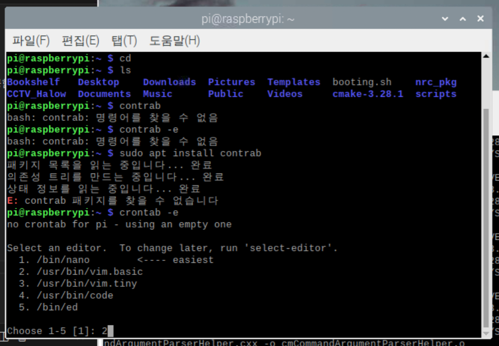
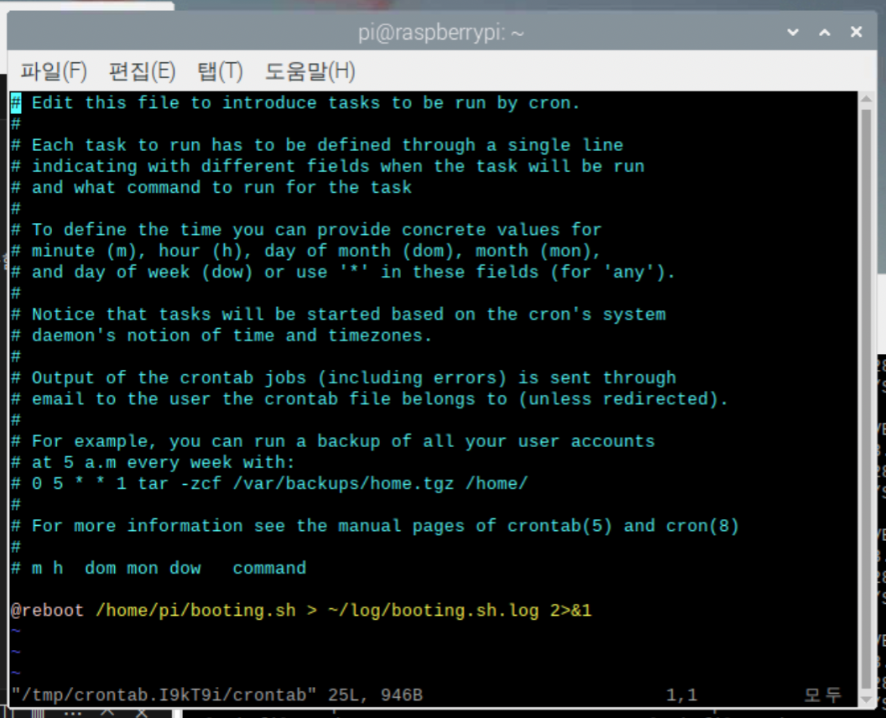

# CCTV Network using Wifi-HaLow (Booting Setup)

터미널 창에서 crontab 실행

* crontab은 부팅 외에도 정해진 시점에서 명령어를 실행해주는 기능을 제공함

```bash
cp ~/CCTV_Halow/booting.sh ~
sudo crontab -e
```

booting.sh가 있는 경로를 crontab 실행 화면에서 아래의 명령어를 아래에 추가

```
@reboot ~/booting.sh > ~/log/booting.sh.log 2>&1
```





