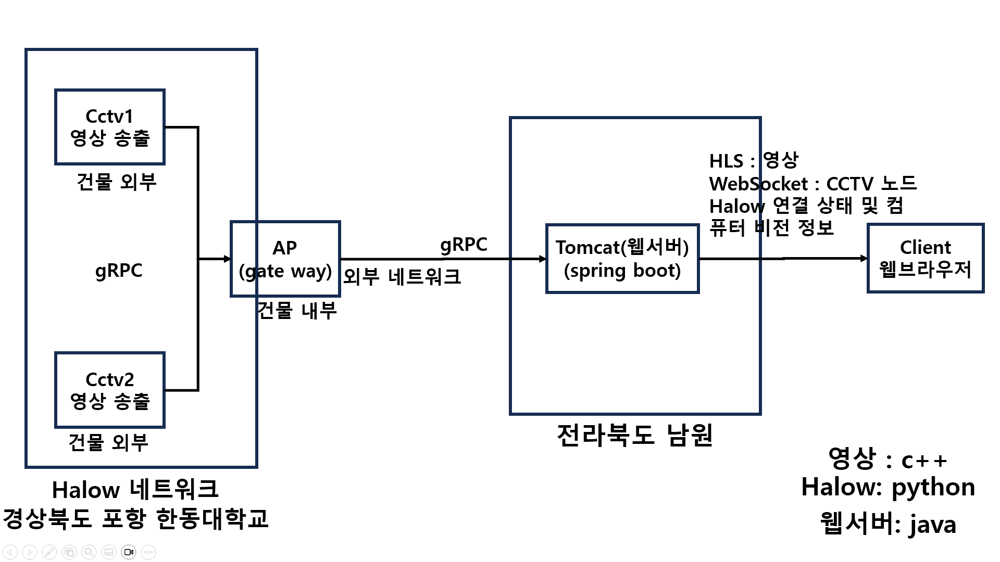

# CCTV Network using WiFi-HaLow

## WiFi HaLow를 활용한 한동 캠퍼스 CCTV IoT 네트워크 구축 
- WiFi HaLow 기술을 활용하여 한동 캠퍼스 안에 IoT 네트워크를 구축하시오. 
- 900 MHz 대역을 사용하는 WiFi HaLow의 경우 기존의 2.4GHz와 5GHz WiFi보다 더 넓은 범위로 신호를 전달 할 수 있음 
- 한동 캠퍼스 내에 분산 배치된 IoT 노드들은 실시간 CCTV 영상을 서버로 전달 해야함. 
- IoT 노드는 라즈베리파이와 카메라를 활용하여 CCTV 노드를 구현해야 함. 
- 서버는 IoT 노드들로부터 전송되는 CCTV 영상을 지속적으로 녹화할 수 있음. 
- 운영자는 웹 인터페이스를 활용하여 서버로 접속할 수 있고, 시각화 도구를 활용하여 캠퍼스 안에 구축된 IoT 노드의 접속 가능 여부와 CCTV 영상 등을 실시간으로 확인할 수 있어야 함. 
- 각종 장애 상황(예: WiFi HaLow 연결 불량, IoT 노드 전원 문제, 서버 상태 불량, 트래픽 등)을 고려 필요 
- 고객에게 이 솔루션을 판매한다고 가정하고 각종 현실적인 문제들을 고려할 것. 
- 사용언어는 C/C++ (Python 사용 금지), 웹 쪽은 자유롭게 구현 
- WiFi HaLow 게이트웨이도 직접 만들어보길 권장 
- 이외에 언급되지 않는 부분들은 자유롭게 진행할 것
- 라즈베리파이 이외에 필요한 재료는 구매해야 하므로 고윤민 교수에게 빠른 시일 내에 연락할 것

## 목적  
노드 : 라즈베리파이+카메라+전원 / 비디오 스트리밍  
서버 : 비디오 수신(with Halow 연결 상태 확인) 및 저장, 웹실행  
웹 인터페이스 : 지도/목록 상에서 각 노드의 상태 확인(위치, 활성화, 배터리) + cctv 재생(실시간)  

## 재료  

라즈베리파이  
카메라  
 [배터리]( https://www.coupang.com/vp/products/7811492839?itemId=21190477617&vendorItemId=88251829458&q=%EC%83%A4%EC%98%A4%EB%AF%B8+%EB%B3%B4%E) 
 [halow 모듈]( https://vctec.co.kr/product/wifi-halow-%ED%86%B5%EC%8B%A0-hat-%EB%B3%B4%EB%93%9C-915mhz-alfa-network-wifi-halow-hat/20592/#none) 
[halow 안테나]( https://vctec.co.kr/product/wifi-halow-%EC%95%88%ED%85%8C%EB%82%98-sma-915mhz-wifi-halow-antenna-sma-915mhz/20591/category/161/display/1/#none) 

## Project Architecture

