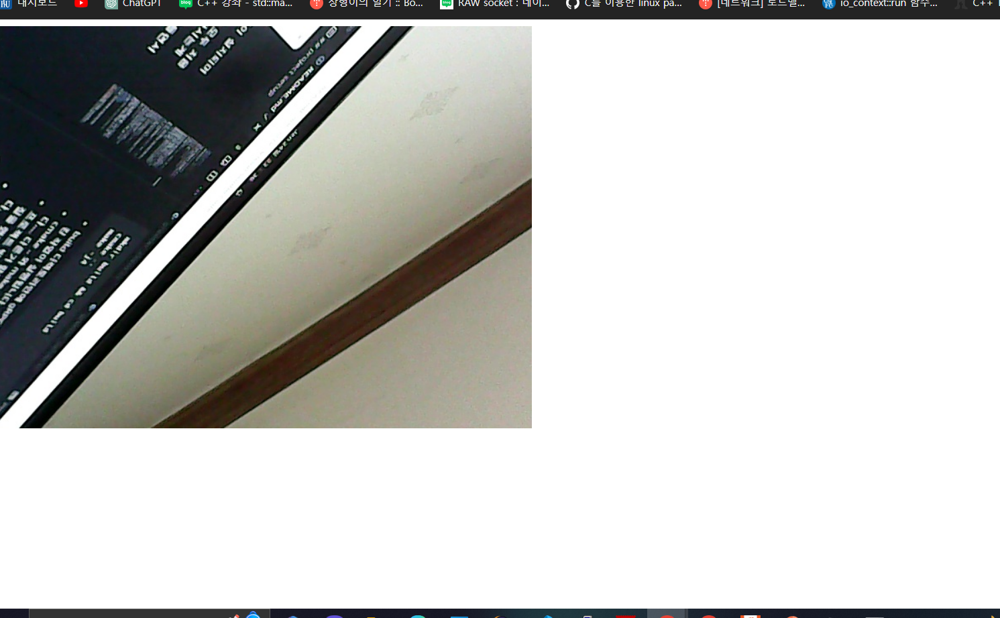
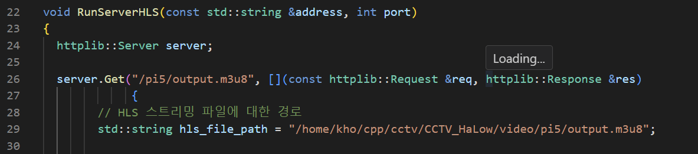
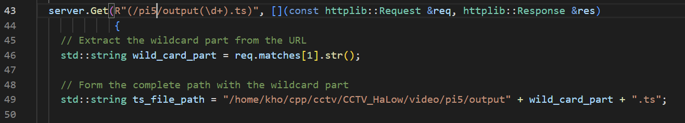
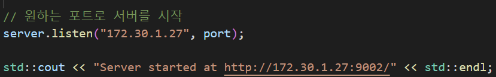
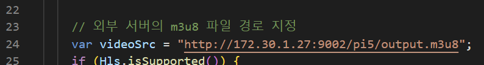

# gRPC 이용한 CCTV 영상 전송

## project setup

- 필요 라이브러리 : `g++`,`cmake` ,`opencv`, `gRPC c++`

```
kho@kho-desktop:~$ cmake --version
cmake version 3.28.1
```

```
kho@kho-desktop:~$ pkg-config --modversion opencv4
4.9.0
```

- cmake를 설치해줍니다.(cmake는 되도록이면 버전을 맞춰주세요 오래된 버전이면 cmake가 실행 안될 수 도있습니다.)

```
wget https://github.com/Kitware/CMake/releases/download/v3.28.1/cmake-3.28.1.tar.gz
```

[wget 안되면 참조](https://cmake.org/download/)

```
# 압축 해제
tar -xvzf cmake-3.28.1.tar.gz

# 디렉토리 이동
cd cmake-3.28.1/

# 설치
./bootstrap
make
sudo make install
```

- 다음의 명령어들을 통해 opencv를 사용하기 위한 필수 라이브러리를 설치해줍니다.

```
sudo apt-get install pkg-config # 컴파일 및 링크시 필요한 라이브러리 정보를 메타파일로부터 가져옴 
sudo apt-get install libjpeg-dev libtiff5-dev libpng-dev # 이미지 파일 로드 및 저장
sudo apt-get install ffmpeg libavcodec-dev libavformat-dev libswscale-dev libxvidcore-dev libx264-dev libxine2-dev # 특정 코덱의 비디오 파일 읽기/쓰기
sudo apt-get install libv4l-dev v4l-utils # 실시간 웹캠 비디오 캡처를 위한 디바이스 드라이버 및 API
sudo apt-get install libgstreamer1.0-dev libgstreamer-plugins-base1.0-dev # 비디오 스트리밍 라이브러리 설치 (Gstreamer)
sudo apt-get install libgtk-3-dev # opencv GUI (이외: libgtk2.0-dev, libqt4-dev, libqt5-dev)
sudo apt-get install libatlas-base-dev gfortran libeigen3-dev # OpenCV 최적화 라이브러리
sudo apt-get install python3-dev python3-numpy # OpenCV-Python 바인딩 & 행렬 연산
sudo apt install unzip
```

- gcc 업데이트를 진행합니다.

  ```
  sudo apt install --only-upgrade gcc
  ```
- opencv 설치 합니다.

```
cd ~
mkdir opencv && cd opencv
git clone --branch 4.9.0 https://github.com/opencv/opencv.git
git clone --branch 4.9.0 https://github.com/opencv/opencv_contrib.git
cd ./opencv
mkdir build && cd build
```

- 현재 프로젝트 루트에 위치한 opencv_cmake.sh를 방금전 만든 build 디렉토리로 갖고와서 실행합니다.

```
mv ~/CCTV_Halow/opencv_cmake.sh ~/opencv/opencv/build
sh opencv_cmake.sh
```

```
nproc # 자신 시스템의 코어 수 확인

# build (modify the core number '12' after option -j accordingly)
make -j4 # 자신 시스템 코어 수에 맞게 -j 다음의 숫자를 변경

# install
sudo make install

# check if it is installed successfully
pkg-config --modversion opencv4
```

- 영상을 브라우저에서 확인하기위해서 웹소켓 라이브러리를 설치합니다.

```
sudo apt-get install libwebsocketpp-dev
sudo apt-get install libboost-all-dev
```

- 프로젝트를 구성하기 전 필수 라이브러리를 설치합니다.

```
sudo apt install -y build-essential autoconf libtool pkg-config
sudo apt-get install libsystemd-dev
```

- 이제 git clone을 통해 프로젝트를 가져오고 프로젝트 루트 터미널에서 다음 명령어를 통해 빌드를 수행합니다.

```
mkdir build && cd build
cmake ..
make -j4
```

- cmake FetchContent를 이용해 build 디렉토리안에 gRPC를 포함한 필요 라이브러리들이 설치되며 오브젝트파일의 링킹 작업이 실행됩니다.
- cmake .. 와 make -j4는 따로따로 실행해주세요(두 과정 모두 처음 실행시 오래 걸립니다.... 다른거 할거를 준비해주시고 시작하시는게 좋습니다....)
- 프로젝트 빌드를 cmake로 자동화하긴 했지만 저도 이부분은 만들면서 수많은 에러와 삽질을 했기 때문에 제발 에러가 안났으면 좋겠지만 에러가 난다면... 바로 연락주시면 됩니다.
- `could not find openssl` 에러 나오신 분은 os에 기본적으로 openssl 라이브러리가 안깔려서 나오는것이니 아래의 명령어를 통해 openssl lib를 깔아주세요.

```
# sudo apt-get update
sudo apt-get install libssl-dev
```

## 실행

- 빌드가 무사히 완료되었다면 /project_root/build/bin 폴더로 이동합니다.

### 서버 실행

```
./program_server <Port>
```

### 클라이언트 실행

```
./program_client <Ip:Port> <Pi_Name>
```

### ~~웹소켓을 이용한 jpg 방식의 실시간 영상 플레이~~

- ~~/project_root/lib/server에 위치한 browser.html을 크롬같은 웹브라우저로 실행하시면 웹브라우저에서 영상을 볼 수 있습니다.~~



### ffmpeg + HLS를 이용한 실시간 영상 플레이

- /project_root/lib/server에 위치한 hlsjs.html을 크롬같은 웹브라우저로 실행하시면 웹브라우저에서 영상을 볼 수 있습니다.
- `./lib/server/ServerStartAPI.cc` 파일에서 아래 함수들의 절대 경로를 실제 개발환경에 맞게 바꿔줘야 하며 코드에 있는 `pi5`는 모두 client 실행시 cmd 인자로 입력했던 pi 이름으로 바꿔줘야합니다.(vsc 사용시 ctrl + h 추천)
- `/home/kho/cpp/cctv/CCTV_HaLow/video/<파이 이름>/output.m3u8`





- 만약 여러대의 cctv를 테스트 하시려면 위의 두 함수를 cctv 개수만큼 복사하시고 동적으로 pi 이름을 할당하시면 됩니다.
- `./lib/server/ServerStartAPI.cc` 파일에서  맨아래 `listen()`에 c++ http 서버의 주소를 적어줍니다.



- hlsjs.html에서 c++서버가 돌아가고 있는 주소를 입력해주시고 `pi5`를 입력한 pi이름 으로 바꿔주세요.



- 만약 여러대의 cctv를 테스트 하시려면 html 파일을 cctv 개수만큼 복사하시고 동적으로 pi 이름을 할당하시면 됩니다.

## Reference

- [cmake 구성](https://modoocode.com/332)
- [우분투에 opencv설치](https://roytravel.tistory.com/383)
- [라즈베리 파이(os)에 opencv 설치](https://make.e4ds.com/make/learn_guide_view.asp?idx=116)
- [gRPC C++ docs](https://grpc.io/docs/languages/cpp/quickstart/)
- [hls기반 http c++ 서버 구축을 위해 사용한 httplib.h](https://github.com/yhirose/cpp-httplib/blob/master/httplib.h)
- [hlsjs.html](https://github.com/unknownpgr/node-webcam-streaming/blob/master/public/index.html)
